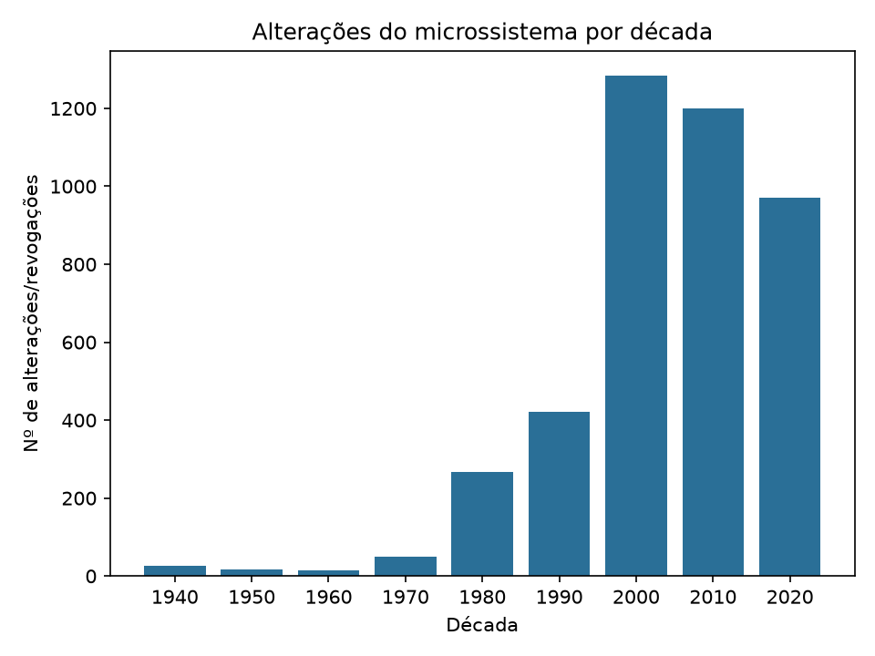
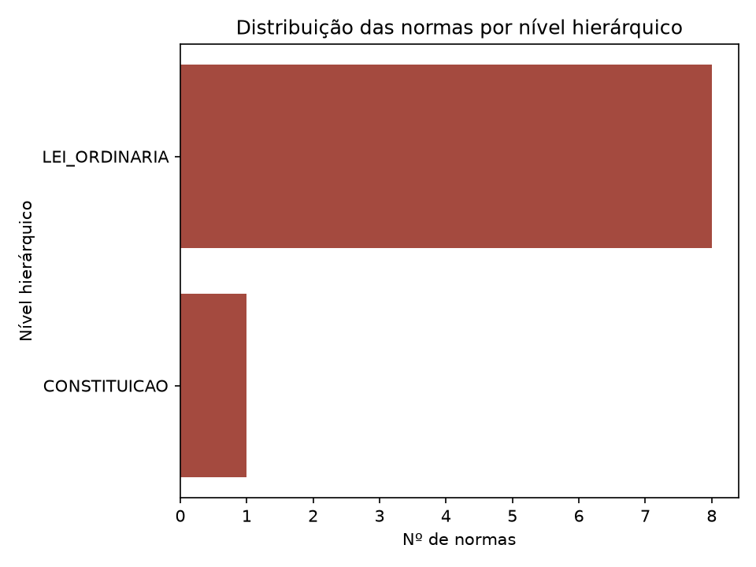
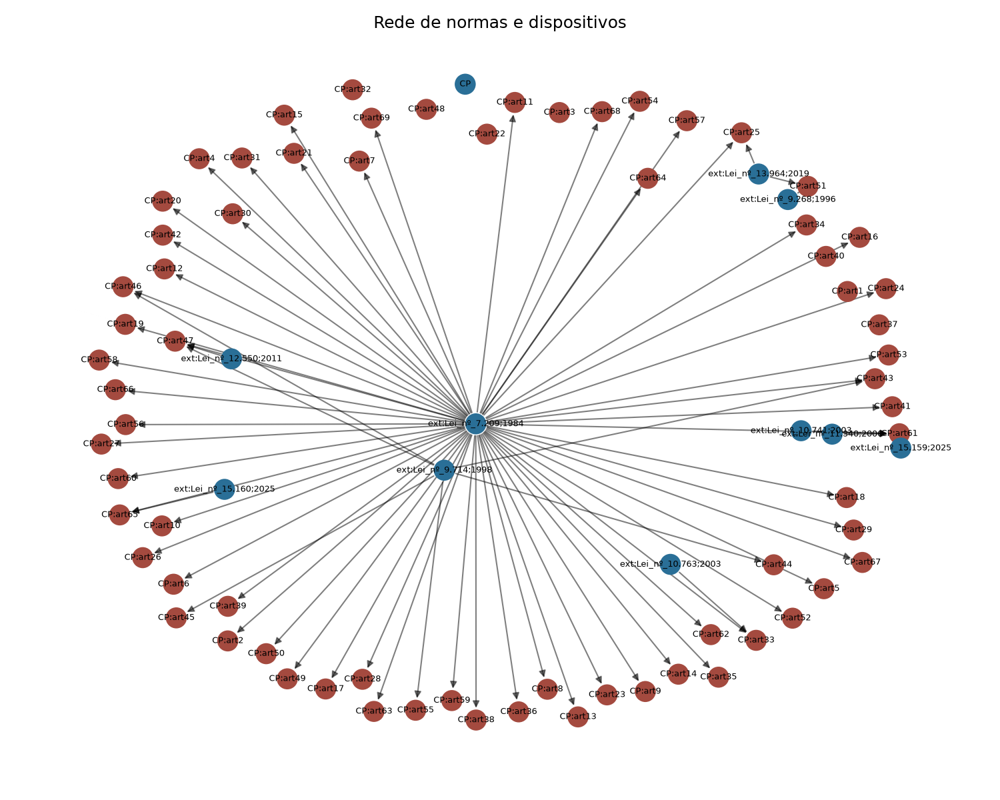

# Letra da Lei — RAG hierarquia- e vigência-aware sobre o microssistema penal federal

## Identificação

- **Aluno:** Anderson Felipe Paixão Corrêa
- **Disciplina:** Sistemas Cognitivos com Large Language Models (INFNET, 26E2_3)
- **Título do projeto:** Letra da Lei — o direito como dado: RAG e análise do microssistema penal federal
- **Repositório (reprodução):** https://github.com/andersonfpcorrea/26E2_3

---

## Acesso aos artefatos

> Todos os artefatos do projeto — as sete notebooks executadas, o código-fonte do pacote `direito_dados`, o corpus bruto, as figuras e os testes — estão no repositório público abaixo. As notebooks são renderizadas diretamente pelo GitHub, com todas as saídas e gráficos visíveis no navegador, sem necessidade de instalação.
>
> - **Repositório:** https://github.com/andersonfpcorrea/26E2_3
> - **Notebooks executadas (renderizadas no GitHub):**
>   `c01_modelos_llm.ipynb` · `c02_prompting.ipynb` · `c03_embeddings_busca.ipynb` ·
>   `c04_inferencia_local_ou_remota.ipynb` · `c05_rag_pipeline.ipynb` · `c06_antinomias.ipynb` ·
>   `c07_lei_como_dado.ipynb`
> - **Código-fonte:** `direito_dados/` (pacote instalável, testado, com 116 testes em `tests/`)
> - **README com instruções de uso:** `README.md`
> - **Corpus bruto (snapshot versionado):** `data/raw/`
> - **Figuras deste relatório:** `report/figures/`

Cada notebook é deliberadamente fina: importa e chama funções já implementadas e testadas em `direito_dados/`, em vez de reimplementar lógica em células soltas. Essa escolha de arquitetura — "a notebook empacota, o pacote implementa" — significa que qualquer resultado mostrado abaixo é reproduzível fora do Jupyter, via `pytest` ou via um script Python comum.

---

## Problema e motivação

O direito penal brasileiro é extenso, estratificado em normas de hierarquias diferentes e **constantemente autoemendado** — a ponto de uma pergunta aparentemente simples ("esse artigo ainda vale?") ser difícil de responder com segurança para um cidadão leigo, e mesmo para um profissional sem acesso a uma base atualizada. Este projeto explora até onde um sistema de **Retrieval-Augmented Generation (RAG)** consciente de **hierarquia normativa** e de **vigência** consegue ajudar a navegar essa complexidade.

O objetivo civil do projeto é **democratizar a compreensão** da complexidade da lei — não substituir análise jurídica. Essa distinção é deliberada e estrutural, não apenas uma ressalva de rodapé:

> **O sistema nunca conclui sobre a situação legal de ninguém.** Ele localiza, fundamenta, cita e explica normas relevantes; aponta *candidatos* a conflito para revisão humana; e se abstém quando não há base suficiente. Isso não é aconselhamento jurídico, parecer, nem qualquer forma de consulta — é uma ferramenta de pesquisa e compreensão de texto legal.

Essa postura de "candidato, nunca veredito" está implementada em código, não apenas declarada: toda aresta `conflict_candidate` produzida pelo detector de antinomias carrega `verification_state=CANDIDATE` (nunca `VERIFIED`), e toda citação retornada pelo RAG passa por verificação programática contra o corpus antes de ser aceita.

Escolher esse enquadramento também transforma perguntas difíceis de avaliar ("essa é uma boa orientação jurídica?") em perguntas mensuráveis: quantas emendas o Código Penal recebeu por década? Quantos conflitos candidatos o detector encontra e com que precisão/revocação? Qual a taxa de citação alucinada do RAG? Essas são as perguntas que as sete notebooks respondem, uma por uma, e que este relatório consolida.

---

## Descrição e obtenção do corpus

O corpus cobre as **9 normas do microssistema penal federal brasileiro**, delimitado pela competência legislativa penal **exclusiva da União** (CF, art. 22, I) — um recorte que é completo por definição constitucional, não truncado por conveniência (direito penal estadual/municipal simplesmente não existe no Brasil):

| Norma | Descrição | Artigos |
| --- | ---: | ---: |
| CF | Constituição Federal (1988) | 512 |
| CP | Código Penal (Decreto-Lei 2.848/1940) | 431 |
| CPP | Código de Processo Penal (Decreto-Lei 3.689/1941) | 849 |
| LEP | Lei de Execução Penal (Lei 7.210/1984) | 219 |
| L11343 | Lei de Drogas (Lei 11.343/2006) | 114 |
| L11340 | Lei Maria da Penha (Lei 11.340/2006) | 60 |
| L8072 | Lei de Crimes Hediondos (Lei 8.072/1990) | 20 |
| DL3688 | Lei das Contravenções Penais (Decreto-Lei 3.688/1941) | 75 |
| LINDB | Lei de Introdução às Normas do Direito Brasileiro (Decreto-Lei 4.657/1942) | 30 |
| **Total** | | **2.310** |

Dos 2.310 artigos, **2.248 estão em vigor** (1.215 na redação original/`vigente` + 1.033 `alterado` por emenda posterior) e **62 estão revogados**. A LINDB merece destaque à parte: é a própria norma que **codifica as regras de resolução de antinomias** (*lex superior*, *lex posterior*, *lex specialis*) usadas pelo detector de conflitos da seção correspondente — está no corpus tanto como objeto de análise quanto como fonte dos princípios que orientam essa análise.

**Fonte e obtenção.** O texto de cada norma é obtido do **Portal da Legislação do Planalto** (`planalto.gov.br`), que publica a *redação consolidada* de cada lei com anotações inline de vigência — por exemplo `(Redação dada pela Lei nº 13.964, de 2019)` ou `(Revogado pela Lei nº 12.015, de 2009)`. Essas anotações são a matéria-prima de todo o projeto: delas derivam tanto o grafo de emendas/revogações (seção "Direito como Dado") quanto o filtro de vigência da recuperação (seção "Embeddings e Busca").

Um snapshot já processado acompanha o repositório em `data/raw/` (textos de domínio público, um arquivo `.txt` por norma), de modo que a reprodução do projeto **não depende de acesso à rede**. Para rebaixar as normas diretamente do Planalto:

```bash
make data      # equivale a: uv run python scripts/fetch_corpus.py
```

O script (`scripts/fetch_corpus.py`) percorre o registro de 9 normas (`direito_dados.corpus.registry.NORMS`), baixa cada uma via `direito_dados.corpus.fetch.download_norm` com um intervalo de cortesia de 1,5s entre requisições, e reporta falhas individuais sem abortar o lote inteiro — uma norma que falhe é simplesmente pulada e pode ser tentada de novo depois.

---

## Justificativa do corpus e do uso de LLMs

**Por que este corpus.** Três propriedades tornam o microssistema penal federal um recorte particularmente produtivo para este projeto:

1. **Escopo fechado e legalmente completo.** Por ser competência exclusiva da União, o recorte não é uma amostra arbitrária — é o universo inteiro do domínio. Isso permite construir *gold sets* pequenos, mas exaustivos o bastante para avaliação (ex.: o conjunto de recuperação de 6 perguntas e o conjunto de antinomias de 3 pares), algo inviável em um corpus de escala nacional irrestrita.
2. **Complexidade real, tamanho tratável.** Com 2.310 artigos, 9 hierarquias/datas de promulgação diferentes e milhares de emendas históricas, o corpus tem estrutura genuinamente difícil (hierarquia normativa, vigência artigo a artigo, potenciais antinomias) sem exigir infraestrutura de escala industrial — uma decisão consciente de custo e reprodutibilidade em ambiente acadêmico.
3. **Anotações de vigência prontas para extração.** O Planalto já anota cada alteração/revogação inline. Isso torna a vigência **metadados extraíveis por regex** em vez de um problema de NLP não resolvido — o que libera o projeto para investir esforço onde realmente há um problema difícil de linguagem natural: recuperação semântica, geração fundamentada e adjudicação de conflitos.

**Por que LLMs.** O projeto usa LLMs em três papéis distintos e complementares, cada um escolhido porque a tarefa correspondente **não é resolvível de forma puramente determinística**:

- **Geração de respostas em linguagem natural** fundamentadas em texto legal recuperado — reformular dispositivos técnicos em prosa compreensível é uma tarefa de linguagem, não de busca.
- **Adjudicação de *lex specialis*** entre dois dispositivos candidatos a conflito — decidir qual norma é "mais específica" exige leitura semântica do conteúdo, não apenas comparação de metadados (ao contrário de *lex superior*/*lex posterior*, que são puramente determinísticos a partir de hierarquia e data).
- **Embeddings semânticos** para recuperação — encontrar o artigo relevante para uma pergunta em linguagem natural do cidadão ("quem mata alguém") exige mapear vocabulário coloquial para vocabulário jurídico, algo que buscas lexicais puras fazem mal (ver a seção de embeddings, caso do art. 171).

Ao mesmo tempo, o projeto **não terceiriza para o LLM aquilo que pode ser feito de forma determinística e auditável**: vigência é regex sobre anotações do Planalto, *lex superior*/*lex posterior* são cálculo sobre metadados, e toda citação emitida pelo modelo é verificada programaticamente contra o corpus antes de ser aceita. Essa divisão de trabalho — LLM para julgamento semântico, código determinístico para tudo que pode ser determinístico — é o fio condutor de todas as decisões de arquitetura descritas a seguir.

---

## Modelos e ferramentas

| Papel | Modelo/Ferramenta | Onde é usado |
| --- | --- | --- |
| Tokenização subword / MLM ilustrativo | `neuralmind/bert-base-portuguese-cased` (BERTimbau) | c01 — exploração de encoder de propósito geral |
| Embeddings de recuperação (encoder de produção) | `intfloat/multilingual-e5-base` (`E5Embedder`) | c03, c05, c06 — indexação e consulta |
| Geração / decoder (produção) | `llama3.1:8b` via Ollama (`OllamaClient`) | c02, c04, c05, c06 |
| Vector store | ChromaDB (`chromadb.EphemeralClient`/`PersistentClient`, distância de cosseno) | c03, c05, c06 |
| Busca lexical | BM25 puro em Python (k1=1,5; b=0,75), sem dependência externa | c03 |
| Framework de tokenização/HF | `transformers` | c01 |
| Embeddings/encoder | `sentence-transformers`, `torch` | c03, c05, c06 |
| Grafo e visualização | `networkx`, `matplotlib` | c07 |
| Corpus (parsing/fetch) | `beautifulsoup4`, `lxml`, `requests` | corpus, scripts/fetch_corpus.py |
| Testes | `pytest` (116 testes, incluindo integração ao vivo com e5 e Ollama) | tests/ |

Toda a geração é **local**, via Ollama — nenhuma chamada a API de nuvem é feita em nenhuma das sete notebooks (a comparação com nuvem, na seção de inferência, é arquitetada e justificada, não executada). Essa escolha é discutida em detalhe na seção "Estratégia de inferência local ou remota".

---

## Tarefas de PLN e Hugging Face (c01)

A notebook `c01_modelos_llm.ipynb` explora, sobre texto real do corpus (o Código Penal), três frentes com a biblioteca `transformers`: tokenização subword, a distinção arquitetural encoder/decoder, e uma tarefa aplicada que compara os dois papéis lado a lado.

### Tokenização subword com BERTimbau

O caput do art. 121 (homicídio) — `"Matar alguem: Pena - reclusão, de seis a vinte anos."` — é tokenizado pelo `neuralmind/bert-base-portuguese-cased` em **18 tokens** (incluindo `[CLS]`/`[SEP]`):

```
[CLS] Mata ##r algu ##em : Pena - rec ##lusão , de seis a vinte anos . [SEP]
```

"Matar" quebra em `Mata`+`##r`; "reclusão" quebra em `rec`+`##lusão`; já "Pena", "seis", "vinte" e "anos" permanecem inteiros. Comparando termos jurídicos raros com termos comuns, a fragmentação em subtokens cresce nitidamente com a raridade do jargão:

| Termo | Nº de subtokens | Subtokens |
| --- | ---: | --- |
| matar | 1 | `matar` |
| casa | 1 | `casa` |
| concussão | 2 | `conc`, `##ussão` |
| peculato | 2 | `pecul`, `##ato` |
| prevaricação | 3 | `prev`, `##ari`, `##cação` |
| estelionato | 4 | `este`, `##lio`, `##na`, `##to` |

Termos técnicos do direito penal (prevaricação, estelionato, peculato) são fragmentados em mais subtokens que vocabulário do dia a dia — sintoma de sub-representação desse jargão no pré-treinamento geral do modelo, e o primeiro indício, ainda no nível de tokenização, de que conhecimento jurídico fino não é garantido por um encoder de propósito geral.

### Encoder vs. decoder — papéis distintos no projeto

O restante do projeto usa dois modelos com papéis deliberadamente diferentes:

| Papel | Modelo | Classe | Uso |
| --- | --- | --- | --- |
| Encoder | `intfloat/multilingual-e5-base` | `E5Embedder` | embeddings de consulta/dispositivo para o `VectorIndex` |
| Decoder | `llama3.1:8b` (Ollama) | `OllamaClient` | geração de resposta citada e adjudicação de conflitos |

Um teste de *fill-mask* com BERTimbau confirma o comportamento bidirecional esperado de um encoder — mascarando a **primeira** palavra da frase ("Paris é a capital da França"), o modelo é forçado a usar apenas o contexto à direita e ainda assim recupera a resposta correta com folga:

```
0.850  Paris é a capital da França.
0.051  Cannes é a capital da França.
0.045  Nice é a capital da França.
```

### Tarefa aplicada: comparação e5 (encoder de recuperação) vs. BERTimbau (encoder de propósito geral)

**Tarefa A — similaridade semântica com e5.** A matriz de similaridade de cosseno entre os embeddings de três dispositivos do CP mostra ordenação semanticamente correta:

|  | art. 121 (homicídio) | art. 155 (furto) | art. 157 (roubo) |
| --- | ---: | ---: | ---: |
| **art. 121 (homicídio)** | 1,000 | 0,906 | 0,858 |
| **art. 155 (furto)** | 0,906 | 1,000 | 0,920 |
| **art. 157 (roubo)** | 0,858 | 0,920 | 1,000 |

Furto e roubo — ambos crimes patrimoniais — têm a maior similaridade (0,920); homicídio e roubo, a menor (0,858). A ordenação relativa é correta, apesar de margens estreitas por causa do vocabulário jurídico genérico compartilhado por todos os artigos do Código.

**Tarefa B — achado honesto sobre conhecimento paramétrico jurídico fraco.** Um teste de *cloze* jurídico com BERTimbau mascara exatamente o elemento distintivo do crime de furto:

```python
"Subtrair, para si ou para outrem, coisa alheia [MASK]: pena de reclusão."
```

O caput real do art. 155 é *"coisa alheia **móvel**"* — mas a palavra correta não aparece entre as cinco previsões mais prováveis do modelo, e todos os scores ficam abaixo de 0,1 (contra 0,850 no cloze genérico de Paris):

```
0.082  'proibida'
0.055  'qualquer'
0.053  '.'
0.049  'a'
0.039  '"'
```

O modelo acerta o padrão sintático (as previsões são adjetivos/pronomes plausíveis na posição), mas erra o termo técnico exato — evidência direta de que um encoder de propósito geral **não memorizou de forma confiável** a colocação jurídica "coisa alheia móvel", o elemento que distingue furto de outros crimes patrimoniais. Este é o achado central da notebook e a motivação empírica, ainda no capítulo 1, para toda a arquitetura de RAG que segue: se o conhecimento paramétrico é raso mesmo para um termo tão central de um crime tão comum, respostas fundamentadas em texto recuperado — não em memória do modelo — deixam de ser apenas uma boa prática e passam a ser uma necessidade.

---

## Engenharia de prompt e saída controlada (c02)

A notebook `c02_prompting.ipynb` narra a iteração real até o prompt de produção usado por `direito_dados.generation.rag.answer_question`, testando quatro técnicas com chamadas reais ao `llama3.1:8b`: três em ordem crescente de controle sobre a **forma** da saída — sobre o mesmo par de contexto (art. 121 e art. 155 do CP) e a mesma pergunta, *"Qual a pena para quem mata alguém?"* — e uma quarta (chain-of-thought estruturado) voltada ao **raciocínio**, aplicada ao conflito aparente de normas.

O **critério explícito de qualidade** adotado para avaliar e iterar os prompts foi, em todas as versões, objetivo e verificável programaticamente: **(a)** a saída é parseável (`parse_ok`); **(b)** o array `citations` vem preenchido com os ids exatos dos dispositivos efetivamente usados; **(c)** `abstained` é coerente com o contexto fornecido. Cada versão de prompt foi julgada contra esse critério, e é ele que organiza a tabela comparativa ao final desta seção.

### Técnica 1 — Zero-shot, prosa livre

Sem *system prompt* estruturado e sem restrição de formato, o modelo responde corretamente em conteúdo:

> "A pena prevista para o homicídio (matar alguém) não está explicitamente mencionada nas normas apresentadas, mas é possível inferir que a pena seria de reclusão por um período que varia de acordo com as circunstâncias do crime."

Mas o *parser* de saída falha: `parse_ok=False`, `abstained=True`, `citations=[]`. **Lição:** texto livre não é suficiente para um sistema que precisa citar fontes verificáveis — não há nenhuma estrutura da qual extrair uma citação, mesmo quando a resposta em si é aceitável.

### Técnica 2 — JSON não guiado (sem contrato de chaves)

Com `format="json"` do Ollama, mas um *system prompt* fraco ("Responda em formato JSON"), o modelo produz JSON sintaticamente válido, porém com chaves diferentes das esperadas:

```json
{ "resposta": "A pena para quem mata alguém varia dependendo da circunstância do crime e da intenção do agente, mas geralmente é classificada como homicídio doloso. A pena por homicídio doloso pode variar de 12 a 30 anos de reclusão, conforme o Código Penal Brasileiro." }
```

`parse_ok=True`, mas `citations=[]` — a chave é `"resposta"`, não `"answer"`/`"citations"`. **Lição:** JSON válido não é o mesmo que *schema* correto. (O conteúdo também está factualmente incorreto: a pena real do art. 121 é de 6 a 20 anos, não "12 a 30".)

### Técnica 3 — Few-shot + saída controlada por schema (versão de produção)

O `SYSTEM_PROMPT` de produção (`direito_dados.generation.prompt`) combina cinco regras explícitas — responder somente com base no contexto fornecido, listar os ids exatos usados em `citations`, abster-se quando as provisões não bastarem, responder em português, e emitir **estritamente** JSON com um conjunto fixo de chaves — com um **exemplo preenchido** (few-shot) embutido no próprio prompt:

```
EXEMPLO de resposta correta quando o contexto contém [CP:art121] "Matar alguém:
Pena - reclusão, de seis a vinte anos":
{"answer": "Matar alguém (homicídio) é punido com reclusão de 6 a 20 anos.",
 "citations": ["CP:art121"], "hierarchy_notes": "", "abstained": false, "confidence": 0.9}
```

A saída é restrita por um **JSON schema** passado ao parâmetro `format` do Ollama (não apenas `format="json"` genérico), garantindo que a resposta sempre tenha exatamente as chaves esperadas:

```python
ANSWER_SCHEMA = {
    "type": "object",
    "properties": {
        "answer": {"type": "string"},
        "citations": {"type": "array", "items": {"type": "string"}},
        "hierarchy_notes": {"type": "string"},
        "abstained": {"type": "boolean"},
        "confidence": {"type": "number"},
    },
    "required": ["answer", "citations", "abstained", "confidence"],
}
```

Além disso, o prompt do usuário lista explicitamente os **ids citáveis** disponíveis ao final do contexto — o mecanismo que torna a citação verificável em vez de livre:

```
Ids disponíveis para citação: CP:art121, CP:art155
Em "citations", liste os ids exatos (ex.: "CP:art121") dos dispositivos acima que
você usou na resposta.
```

Com essa configuração, a estrutura da resposta é sempre correta (`parse_ok=True`, chaves certas, citações parseáveis) — mas a notebook documenta honestamente que o *schema* resolve o problema de **forma**, não o de **conteúdo**: em uma execução real, o modelo local de 8B parâmetros citou corretamente `CP:art121` mas também `CP:art155` (irrelevante para a pergunta) e mencionou "pena de morte em alguns países", que não existe no Código Penal nem no contexto fornecido. A conclusão da notebook é direta: *"o schema resolve o problema estrutural (parseabilidade/forma), não o problema de raciocínio/precisão factual do modelo"* — um limite honesto do modelo local, retomado com mais profundidade na seção de RAG.

Um teste final confirma **abstenção coerente**: com contexto vazio (nenhuma provisão recuperada) para a pergunta fora de escopo *"Qual o prazo prescricional do IPTU?"*, o modelo retorna `{"answer": "", "citations": [], "abstained": true, "confidence": 1.0}` — sem inventar uma resposta.

### Técnica 4 — Chain-of-thought estruturado (raciocínio antes do veredito)

As três técnicas anteriores atacam a **forma** da saída; chain-of-thought ataca o **raciocínio** — e o enunciado o recomenda "quando fizer sentido". No domínio jurídico ele faz sentido exatamente onde este projeto mais precisa dele: no **conflito aparente de normas**, que exige raciocínio em etapas (identificar os dispositivos aplicáveis → testar a relação de especialidade → concluir pela *lex specialis*). O experimento usa o caso clássico da doutrina — homicídio (art. 121, norma geral) vs. infanticídio (art. 123, norma especial) — em duas variantes sobre o mesmo contexto: **(A)** veredito direto (schema pede apenas `dispositivo` + `justificativa`); **(B)** CoT estruturado (o schema inclui um campo `raciocinio`, lista de passos, **antes** dos campos de veredito — como a geração é autoregressiva, os tokens de raciocínio são gerados antes do veredito, condicionando-o, em vez de uma racionalização a posteriori).

No resultado real, **as duas variantes acertam o veredito** (`CP:art123`, infanticídio) — o caso é clássico o bastante para o modelo de 8B. A diferença está no que cada saída permite **auditar**. A Variante B expõe o teste de especialidade passo a passo:

```json
"raciocinio": [
  "(2) ... Sim, porque o art. 123 especifica que a conduta deve ser cometida pela
   gestante sob influência do estado puerperal e contra o próprio filho.",
  "(3) O dispositivo específico [prevalece], pois ele contém elementos adicionais
   que não estão presentes no art. 121."
],
"dispositivo": "CP:art123"
```

Em um sistema que só emite **candidatos para revisão humana**, essa auditabilidade é o valor real do chain-of-thought: o revisor confere o *porquê*, não apenas o *o quê*. É por isso que o adjudicador de antinomias de produção (`direito_dados.conflicts.detector`, seção c06) exige o campo `rationale` no schema do veredito — a mesma técnica, institucionalizada no pipeline.

**Resumo comparativo — as três técnicas de forma, avaliadas contra o critério explícito de qualidade:**

| Técnica | Mecanismo | `parse_ok` | Citações confiáveis? | Abstenção coerente? |
| --- | --- | :---: | :---: | :---: |
| 1. Zero-shot | instrução livre, sem `format` | não | não (nem chega a parsear) | não |
| 2. JSON não guiado | `format="json"`, sem contrato de chaves | sim | não (chaves divergentes) | não confiável |
| 3. Few-shot + schema | `SYSTEM_PROMPT` (com exemplo) + `format=<schema>` + ids explícitos | sim | sim | sim |

A Técnica 3 é a usada em produção, ainda apoiada por `parse_answer` como rede de segurança: se, apesar do schema, a saída vier malformada, o parser falha para o lado seguro (`abstained=True`, `parse_ok=False`) em vez de lançar exceção ou fabricar uma estrutura.

---

## Embeddings, estratégia de busca e avaliação (c03)

A notebook `c03_embeddings_busca.ipynb` cobre o subsistema de recuperação sobre um subconjunto de 545 artigos (CP + Lei de Drogas), sem reimplementar nenhuma lógica de recuperação — apenas exercitando os módulos já testados de `direito_dados.retrieval`.

### Modelo de embeddings e estratégia de chunking

O modelo é o `intfloat/multilingual-e5-base`, usado com os prefixos assimétricos que ele exige (`"passage: "` para textos indexados, `"query: "` para consultas — omiti-los degrada a qualidade da recuperação).

A unidade de indexação (`Chunk`) é **um por artigo**, mas o texto efetivamente embutido não é o corpo bruto do artigo: é `"{caput}. {texto}"[:300]` — uma estratégia de **chunking caput-forward**. O *caput* (a frase de abertura do artigo, normalmente a descrição nuclear da conduta) é repetido no início do texto embutido, dando a ele peso extra na representação semântica. A motivação é que muitos artigos têm parágrafos e incisos longos que, sozinhos, diluiriam o sinal do *caput* se fossem embutidos sem esse reforço. Exemplo real, art. 121:

```
embed_text: "Matar alguem:. Matar alguem:
Pena - reclusão, de seis a vinte anos.
Caso de diminuição de pena
§ 1º Se o agente comete o crime impelido por motivo de relevante valor social ou moral..."
```

Note o caput ("Matar alguem:") literalmente repetido no início do texto embutido. Para a consulta em linguagem natural "qual a pena para quem mata alguém?", essa estratégia resulta em `CP:art121` recuperado em **1º lugar** (score 0,891), seguido de dispositivos correlatos (`art. 121-B`, `art. 226`, `art. 147`, `art. 121-A`):

```
Consulta: "qual a pena para quem mata alguém?"
  CP art. 121                  score=0.891
  CP art. 121-B                score=0.866
  CP art. 226                  score=0.861
  CP art. 147                  score=0.858
  CP art. 121-A                score=0.858
```

Outras duas consultas de domínios distintos confirmam a mesma precisão temática — "furto de coisa alheia móvel" recupera o cluster de crimes patrimoniais (art. 168, 155, 157...) e "tráfico ilícito de entorpecentes" recupera exclusivamente artigos da Lei de Drogas (18, 17, 50-A...).

### Vector store e filtragem por vigência

O índice é construído em **ChromaDB** (distância de cosseno), com **524 passagens únicas** após deduplicação de colisões de id geradas por um artefato conhecido do parser em incisos da Lei de Drogas (Art. 8º-A a 8º-F colapsando em `L11343:art8`).

A propriedade de segurança mais importante da camada de recuperação é a **exclusão de dispositivos revogados por padrão** (`exclude_revoked=True`). Uma consulta desenhada para "casar" com um artigo revogado — *"violação sexual mediante fraude"*, que corresponde ao antigo art. 214 (revogado pela Lei 12.015/2009) — demonstra isso na prática:

```
-- exclude_revoked=True (padrão) --
  CP art. 203   score=0.849   status=alterado
  CP art. 273   score=0.849   status=alterado
  ...                                            (art. 214 ausente)

-- exclude_revoked=False --
  CP art. 214   score=0.881   status=revogado    <- maior score de todos
  CP art. 216   score=0.850   status=revogado
  CP art. 203   score=0.849   status=alterado
  ...
```

Com o filtro padrão, `CP:art214` fica de fora do top-5 apesar de ser, sem o filtro, o dispositivo de **maior similaridade** para essa consulta — a redação antiga do crime revogado ainda é o texto que melhor "casa" semanticamente com a pergunta, só que hoje sem nenhum efeito jurídico. O filtro de metadados intercepta esse caso antes que ele chegue à resposta final.

### Busca densa vs. híbrida (BM25 + densa)

Um índice BM25 puro (sem dependência externa) é combinado com a busca densa por normalização min-max e fusão ponderada (`alpha * denso + (1-alpha) * léxico`, `alpha=0,5` por padrão). O caso mais informativo é a consulta *"estelionato mediante fraude"*: a busca **densa sozinha** deixa `CP:art171` (estelionato) de fora do top-5 —

```
denso : ['CP:art170', 'CP:art206', 'CP:art183-A', 'CP:art337-L', 'CP:art179']
bm25  : ['CP:art170', 'CP:art204', 'CP:art171', 'CP:art215', 'CP:art178']
híbrido: ['CP:art170', 'CP:art204', 'CP:art171', 'CP:art206', 'CP:art183-A']
```

O motivo é estrutural, não um acaso de embedding: o nome popular do crime ("Estelionato") é um título de seção no texto original do Planalto, descartado pelo parser de artigos — ele nunca aparece no *caput*/texto do art. 171, apenas a redação operativa ("obter vantagem ilícita... mediante artifício, ardil, ou qualquer outro meio fraudulento"). O BM25, puramente lexical, ainda recupera `CP:art171` via sobreposição de termos ("mediante", variações de "fraude"), e a busca híbrida herda esse acerto. Este é um exemplo real de por que um *retriever* só denso pode falhar quando a consulta usa o nome doutrinário/popular de um crime que não está literalmente no dispositivo legal — e por que a fusão híbrida funciona como rede de segurança.

### Avaliação de recuperação

Sobre um conjunto-ouro de 6 perguntas (`GoldItem`), o retriever denso alcança:

```
hit_rate@5 = 0,833   (5/6)
MRR        = 0,625
```

A única falha é uma pergunta deliberadamente fora de escopo (*"Homicídio culposo na direção de veículo automotor"*, esperando `CTB:art302` — o Código de Trânsito não faz parte do corpus). As outras cinco perguntas — incluindo homicídio, furto, roubo, porte de drogas e associação para o tráfico — são todas recuperadas corretamente no top-5, a maioria em 1º lugar. A notebook observa que recuperação por *k* fixo não distingue "não sei" de "a melhor opção que tenho"; esse problema é tratado à parte pela camada de geração, com verificação de citação e abstenção (seção seguinte).

---

## Estratégia de inferência local ou remota (c04)

A notebook `c04_inferencia_local_ou_remota.ipynb` mede a inferência local, arquiteta (sem executar) um baseline em nuvem, e propõe a arquitetura de produção recomendada.

### Justificativa de privacidade, custo e latência

A escolha por geração **local**, via Ollama, é justificada primeiro por privacidade: consultas sobre Direito Penal podem envolver detalhes de casos reais (fatos, nomes, contexto de uma situação concreta que alguém está tentando entender). Rodando inteiramente na máquina — modelo, prompt, geração — nenhum dado trafega pela rede nem passa por terceiro. Sob a LGPD (Lei 13.709/2018), isso elimina de saída toda a superfície de risco associada a compartilhar dados pessoais/sensíveis com um processador externo.

### Latência medida (local)

Três chamadas reais e cronometradas ao `llama3.1:8b` — uma pergunta de prosa curta, uma de prosa comparativa mais longa (furto vs. roubo) e uma com saída JSON estruturada (schema com campos `resposta`/`artigo`) — produziram:

| Chamada | Latência |
| --- | ---: |
| Prosa curta | 2,21 s |
| Prosa longa (comparação) | 2,56 s |
| JSON estruturado | 3,46 s |
| **Média (3 chamadas)** | **2,74 s** |

Nenhuma dessas chamadas passou pela verificação de citação do RAG (rodaram "peladas", sem fundamentação) — o exemplo de saída JSON, aliás, evidencia por que fundamentação importa: o modelo trocou os valores das chaves `"resposta"` e `"artigo"` entre si, um erro de conteúdo que o schema por si só não impede.

### Baseline em nuvem — arquitetado, não executado

`LLMClient` é definido como um `Protocol` (tipagem estrutural), e um `CloudClient` esqueleto satisfaz esse protocolo sem exigir nenhuma chave de API commitada ou lida do ambiente (`OPENAI_API_KEY` verificada como ausente, de propósito). A comparação de qualidade/custo/latência para a nuvem é, portanto, **raciocinada, não medida** — e o relatório é transparente sobre essa distinção:

| Critério | Local (Ollama, `llama3.1:8b`) | Nuvem (API) | Nuvem privada (self-hosted, VPC) |
| --- | --- | --- | --- |
| Privacidade | **Máxima** — nenhum dado sai da máquina | Dados trafegam para o provedor, sujeitos à política de retenção dele | Alta — dados ficam na VPC própria |
| Qualidade | Boa para respostas fundamentadas em RAG; modelo 8B tem limites de raciocínio fora do recuperado | Geralmente superior *(estimativa raciocinada)* | Configurável, conforme GPU disponível *(estimativa raciocinada)* |
| Custo | Sem custo por chamada (hardware amortizado) | Por token, escala com volume *(estimativa raciocinada)* | Infraestrutura de GPU, custo fixo maior, marginal zero *(estimativa raciocinada)* |
| Latência | **Medida: 2,74 s em média** | Rede + fila do provedor somam-se à inferência *(estimativa raciocinada)* | Depende do dimensionamento da VPC *(estimativa raciocinada)* |
| Controle | Total | Baixo — dependente do provedor | Alto — mesma interface `LLMClient` |

### Recomendação de produção

A conclusão não escolhe um extremo: para este projeto, hoje, a inferência **local** é a escolha certa (latência de poucos segundos, custo marginal zero, nenhum dado sai da máquina). Para um cenário de produção com múltiplos usuários, a recomendação é uma **nuvem privada com pesos abertos** — `llama3.1` ou modelo maior, servido via vLLM ou Ollama dentro de uma VPC sem endpoint público, com residência de dados no Brasil (LGPD) e sem logging de terceiros — descrita como uma troca de backend do mesmo `LLMClient`, não uma reescrita do pipeline.

---

## O pipeline RAG: descrição, exemplos e análise de falhas (c05)

A notebook `c05_rag_pipeline.ipynb` exercita `direito_dados.generation.rag.answer_question` de ponta a ponta: recuperação (top-k de dispositivos em vigor) → prompt com ids citáveis → geração local (`llama3.1:8b`) → saída JSON estruturada → verificação de citação → abstenção quando não há base. O índice usado cobre apenas o Código Penal (431 dispositivos, indexado em 12,5s).

### Caso positivo: peculato

Pergunta: *"Qual a pena para o funcionário público que se apropria de dinheiro público em razão do cargo?"*

```
recuperados: ['CP:art312', 'CP:art313', 'CP:art327']
citações:    ['CP:art312']   |   alucinadas: []
abstained:   False
resposta:    "Pena - reclusão, de dois a doze anos."
```

O sistema cita exatamente o dispositivo correto (peculato, art. 312), sem citação alucinada.

### Análise de falha honesta: furto citado como roubo

O caso mais instrutivo do projeto é uma falha real, não construída. O caput do furto (art. 155, *"Subtrair, para si ou para outrem, coisa alheia móvel"*) compartilha vocabulário quase literal com apropriação indébita (art. 168) e roubo (art. 157, *"Subtrair coisa móvel alheia... mediante grave ameaça"*). Para a pergunta *"furto de coisa alheia móvel"*, a recuperação por similaridade já erra o rank 1:

```
CP:art168   score=0.892   'Apropriar-se de coisa alheia móvel...'
CP:art155   score=0.877   'Subtrair, para si ou para outrem, coisa alheia móvel:...'   <- correto, mas 2º lugar
CP:art157   score=0.871   'Subtrair coisa móvel alheia... mediante grave ameaça...'
```

E o RAG completo, condicionado nesse contexto, cita o artigo errado:

```
recuperados: ['CP:art168', 'CP:art155', 'CP:art157']
citações:    ['CP:art157']   |   alucinadas: []
resposta:    "O dispositivo que se aplica ao furto de coisa alheia móvel é o artigo 157 do Código Penal."
```

O ponto crítico é que `hallucinated_citations` fica **vazio** neste caso: `CP:art157` existe de fato no corpus e foi de fato recuperado — não é uma citação inventada, é uma citação **semanticamente incorreta**. A notebook nomeia esse limite com precisão: *"a verificação de citação alucinada confirma que o id existe no corpus, não que o conteúdo citado responde corretamente à pergunta — um limite honesto que nenhum schema resolve sozinho, e a principal motivação para comparar com um baseline em nuvem (mais forte em recuperar nuances lexicais finas do português jurídico) no relatório técnico."*

### RAG vs. sem RAG (memória paramétrica)

Para a pergunta *"Qual a pena para quem mata alguém, segundo o Código Penal brasileiro?"*, a resposta **sem RAG** (o mesmo `llama3.1:8b`, sem nenhum contexto recuperado) fabrica conteúdo com aparência de precisão:

> "O artigo 121 determina as penalidades para homicídio: 'Pena - reclusão, de um a vinte anos.' O §1º do mesmo artigo adiciona detalhes sobre o crime: 'Se deixar o crime impune ou for infâmia ou ferir grave e permanentemente a honra da vítima ou seus familiares.'"

Ambas as citações entre aspas são fabricadas: a pena real é "de **seis** a vinte anos" (não "um"), e o §1º real trata de redução de pena por relevante valor social ou moral — um tema completamente diferente de "infâmia" e "honra da vítima", que o modelo inventou com formatação de citação literal.

**Com RAG**, a resposta cita ids reais e verificados (`CP:art121`, `CP:art226`), sem alucinação de citação — mas ainda contém uma imprecisão de conteúdo (menciona "prisão perpétua", pena inexistente no ordenamento brasileiro, e "até 30 anos", número não presente no art. 121). A notebook resume o limite com uma frase que se tornou o argumento central deste relatório sobre confiabilidade: *"a verificação de citação garante que o id existe e foi de fato recuperado, não que o texto gerado sobre aquele id é factualmente correto."*

### Segurança de vigência dentro do RAG

Repetindo o teste da seção de embeddings, mas agora através do pipeline completo: para *"violação sexual mediante fraude"* (que corresponde ao art. 214, revogado), o RAG recupera `['CP:art203', 'CP:art273', 'CP:art337-L', 'CP:art179', 'CP:art206']` — o art. 214 revogado, que teria o maior score de similaridade bruta (0,881) sem o filtro, nunca chega a ser considerado pela geração.

### Abstenção em pergunta fora de escopo

Pergunta deliberadamente irrelevante: *"Qual a receita de bolo de cenoura?"*. O índice sempre retorna os *k* vizinhos mais próximos (não há corte de relevância na camada de recuperação), mas o modelo, seguindo o `SYSTEM_PROMPT`, reconhece que nada nas provisões recuperadas responde à pergunta:

```
abstained: True
citations: []
resposta:  "A pergunta não está relacionada às provisões fornecidas."
```

### Verificação de citação alucinada — demonstração forçada

Nos testes reais das seções anteriores, o modelo local honesto **não produziu nenhuma citação alucinada**. Para demonstrar o mecanismo de verificação mesmo assim, a notebook injeta um `FakeLLM` programado para citar um id inexistente:

```json
{"answer": "Resposta fabricada citando um artigo inexistente.",
 "citations": ["CP:art999", "CP:art121"], "abstained": false, "confidence": 0.95}
```

```
citações verificadas: ['CP:art121']
citações alucinadas:  ['CP:art999']
```

`CP:art999` é sinalizado e excluído mesmo com `abstained: false` e `confidence: 0.95` afirmados pelo modelo — a verificação é puramente programática (checagem de pertencimento a um conjunto de ids válidos), independente de quão convincente a alucinação pareça.

---

## Detecção de antinomias: princípios, adjudicação e avaliação (c06)

A notebook `c06_antinomias.ipynb` implementa a contribuição mais original do projeto: um detector de **candidatos** a antinomia (conflito normativo) em três etapas, sobre o Código Penal (431 dispositivos vigentes).

### Pipeline em três etapas

1. **Geração de candidatos por similaridade** (`generate_candidates`, `k=3`, limiar de similaridade `0,85`): com 431 dispositivos, a comparação exaustiva seria ~92 mil pares; o filtro por similaridade reduz o espaço a **910 pares** acima do limiar — tratável para adjudicação.
2. **Princípios LINDB — determinísticos onde possível, LLM onde exige leitura semântica.** *Lex superior* (hierarquia) e *lex posterior* (data) são computáveis a partir de metadados, sem LLM. *Lex specialis* (qual norma é mais específica) exige comparar conteúdo, e fica a cargo do adjudicador LLM local, que recebe uma "dica" determinística sempre que aplicável.
3. **Avaliação** (`evaluate_antinomias`) contra um *gold set* pequeno e declaradamente ilustrativo — precisão, revocação e F1.

### Adjudicação dos 12 candidatos de maior similaridade

Por custo computacional, a adjudicação com LLM é limitada aos 12 pares de maior similaridade (todos entre 0,893 e 0,908). Os 12 foram **todos confirmados** como conflito candidato, majoritariamente por *lex specialis* (confiança entre 0,80 e 1,00) — esperado, já que a etapa de geração já filtrou por similaridade temática altíssima. Um exemplo com justificativa textual do próprio LLM:

```
CP:art209 × CP:art210  |  princípio=lex_specialis  confiança=0.80
  razão: "Ambas as normas tratam de violação a sepulturas, mas o art. 210
  (Dispositivo B) aborda especificamente 'violar ou profanar sepultura ou
  urna funerária', sendo considerado mais específico e, portanto, prevalecente."
```

Todos os pares confirmados geram uma aresta `conflict_candidate` no grafo, com `verification_state=CANDIDATE` — nunca um veredito.

### Avaliação contra o gold set

O *gold set* (3 pares, escolhidos e justificados pelo autor, não validados por especialista — limitação declarada explicitamente) cobre três famílias de conflito plausível: estupro vs. estupro de vulnerável (`art. 213` × `art. 217-A`), atentado contra a liberdade de trabalho vs. constrangimento a celebrar contrato (`art. 197` × `art. 198`), e a família de crimes de aborto (`art. 124` × `art. 126`). As métricas resultantes:

```
precisão:  0,167   (tp=2, fp=10)
revocação: 0,667   (tp=2, fn=1)
F1:        0,267
```

A leitura honesta desses números, tal como discutida na própria notebook, é que a precisão baixa **não** significa que os 10 pares "falsos positivos" sejam erros do detector no sentido jurídico — são candidatos igualmente plausíveis que simplesmente não estão no gold set minúsculo de 3 pares contra 12 conflitos candidatos confirmados. Com um denominador dessa ordem de grandeza, a precisão numérica é estruturalmente baixa por construção, não porque o detector erre sistematicamente. O único falso negativo (`art. 197` × `art. 198`) tem causa identificada: esse par não estava entre os 12 candidatos levados à adjudicação — foi cortado ainda na etapa de geração de candidatos por similaridade, evidenciando que o gargalo de recall está no **limiar de geração**, não na adjudicação por LLM. Um gold set maior (~15 pares) verificado por um especialista em direito penal é declarado como trabalho futuro, não como lacuna escondida.

---

## Análise "Direito como Dado" (c07)

A notebook `c07_lei_como_dado.ipynb` trata o microssistema penal como um **grafo com proveniência**, não apenas como texto. Nós são normas (`NORM`) e dispositivos (`PROVISION`); arestas `AMENDS`/`REVOKES` são extraídas diretamente das anotações inline do Planalto (`(Redação dada por...)`, `(Incluído por...)`, `(Revogado por...)`) — fatos verificados do texto oficial (`verification_state=VERIFIED`, `confidence=1.0`).

### Estrutura do grafo

Sobre o corpus completo (9 normas, 2.310 artigos), o grafo tem:

```
Nós:  2.381   (337 NORM + 2.044 PROVISION)
Arestas: 4.727   (4.453 AMENDS + 274 REVOKES)
```

Sobre o subgrafo do Código Penal isoladamente: **979 arestas AMENDS + 47 REVOKES** (1.026 arestas no total), sobre 525 nós ao incluir as normas externas que o emendaram.

### Linha do tempo de emendas

O gráfico de barras abaixo (`report/figures/decades.png`) mostra o total de alterações/revogações do microssistema por década, agregado a partir das arestas `AMENDS`/`REVOKES` do grafo completo:



```
1940: 26    1950: 16    1960: 15    1970: 49    1980: 268
1990: 422   2000: 1.283 2010: 1.199 2020: 970
```

Dois picos concentram a maior parte da narrativa:

- **1984 (261 das 268 alterações da década, todas no CP)**: a **reforma da Parte Geral do Código Penal** (Lei 7.209/1984) — a maior reescrita estrutural do CP desde 1940, introduzindo o sistema atual de aplicação de pena, regimes de cumprimento e circunstâncias atenuantes/agravantes. O grafo captura isso como um único evento em massa concentrado em um ano.
- **2019 (548 alterações — o maior pico anual do corpus)**: não é um evento único, mas a sobreposição de pelo menos três reformas simultâneas de grande porte, visível no *breakdown* por norma (`L11343: 223, CPP: 150, CF: 72, CP: 40, LEP: 30, L11340: 19, L8072: 14`): o **Pacote Anticrime** (Lei 13.964/2019, concentrado em CPP e CP), a **Reforma da Previdência** (EC 103/2019, concentrada na CF) e uma extensa reforma da **Lei de Drogas** quanto à apreensão e destinação de bens (Lei 13.840/2019). Nenhuma norma isolada explica o pico sozinha.

Olhando apenas o Código Penal, a mesma agregação por década mostra um padrão semelhante, com o pico de 1984 ainda mais nítido em proporção: `1960: 5, 1970: 2, 1980: 265, 1990: 95, 2000: 192, 2010: 145, 2020: 294`.

### Vigência derivada em nível de artigo

Um ponto de design deliberado do parser (`direito_dados/corpus/annotations.py`, função `article_status`) é que a vigência de um artigo é derivada **apenas da anotação sobre o próprio *caput***, não de qualquer anotação em qualquer parágrafo do artigo:

```python
def article_status(caput, annotations):
    """Article-level vigência: REVOGADO only if the caput itself is revoked;
    ALTERADO if the article was otherwise touched; else VIGENTE."""
```

Essa é uma correção intencional de um erro fácil de cometer: se um único parágrafo de um artigo grande for revogado, o artigo inteiro **não** deve ser marcado como revogado — ele continua em vigor, apenas alterado. Sem essa distinção artigo-a-artigo, dispositivos amplamente citados (como o próprio art. 121, homicídio, que teve parágrafos alterados ao longo de décadas) correriam o risco de ser classificados incorretamente como revogados por causa de uma única anotação de revogação em um parágrafo específico. Essa é exatamente a mesma lógica que sustenta o filtro `exclude_revoked=True` da recuperação (seção de embeddings): sem granularidade artigo-a-artigo, o filtro de vigência ficaria grosseiro demais para ser confiável.

No CP, 25 artigos estão de fato revogados (caput revogado): `185, 189–196, 214, 216, 217, 219–224, 231, 231-A, 232, 240, 279, 281, 350` — um conjunto dominado pelos antigos "crimes contra os costumes" (Título VI original do CP de 1940), majoritariamente revogados pelas Leis 11.106/2005 e 12.015/2009, que reformaram a nomenclatura e a estrutura dos crimes sexuais no Código.

### Pirâmide de hierarquia



A distribuição calculada (`hierarchy_distribution`) mostra `{'CONSTITUICAO': 1, 'LEI_ORDINARIA': 8}` — apenas dois níveis visíveis, não porque as 9 normas realmente ocupem só duas posições hierárquicas, mas por um efeito colateral técnico digno de nota: `HierarchyLevel` é um `Enum` em que `LEI_ORDINARIA`, `DECRETO_LEI` e `MEDIDA_PROVISORIA` compartilham o mesmo valor numérico (3) — corretamente, do ponto de vista de *lex superior* (as três têm o mesmo peso hierárquico entre si). Mas em Python, membros de `Enum` com valores duplicados viram *aliases* do primeiro nome definido, então `DECRETO_LEI.name` é, na prática, `"LEI_ORDINARIA"`. É por isso que o bucket agrega tanto leis ordinárias propriamente ditas (LEP, L11343, L11340, L8072) quanto decretos-lei pré-1988 com força de lei ordinária (CP, CPP, DL3688, LINDB). Só a CF (nível 1, sem par) aparece isolada — um lembrete de que a representação de dados de um `Enum` pode esconder uma decisão de modelagem que precisa ser lida no código-fonte, não só no gráfico.

### Dispositivos mais alterados

No Código Penal isoladamente, o topo do ranking de alterações é: `art. 121` (homicídio, 22) e `art. 157` (roubo, 22) empatados, seguidos por `art. 129` (lesão corporal, 20), `art. 7` (extraterritorialidade, 20) e `art. 155` (furto, 18). Os dois crimes contra a pessoa e contra o patrimônio mais centrais do Código foram sucessivamente reformados (Lei dos Crimes Hediondos, Pacote Anticrime, entre outras) para endurecer penas e criar qualificadoras. `CP:art171` (estelionato) — o mesmo artigo que a busca só-densa não conseguiu recuperar na seção de embeddings — também aparece no top-10 (17 alterações), reforçando que é um dispositivo central e ativamente atualizado, não marginal, apesar da falha pontual de recuperação lexical.

### Visualização de rede



A figura acima é o subgrafo do Código Penal (525 nós, 1.026 arestas, limitado a 80 nós para legibilidade) — deliberadamente escolhido em vez do grafo completo (2.381 nós seria ilegível em um único desenho). Nós azuis são **normas** (o próprio CP e as leis que o emendaram ao longo do tempo); nós vermelhos são **dispositivos** (artigos). As arestas convergindo de várias normas emendadoras para os mesmos artigos centrais (homicídio, roubo, furto, estelionato) tornam visível, de forma literal, por que esses dispositivos lideram o ranking de alterações: eles são hubs de grau alto no grafo, não apenas números em uma tabela.

Um detalhe de design vale registro: excluir nós externos (`include_external=False`) deixa 2.053 nós **sem nenhuma aresta** — porque toda aresta `AMENDS`/`REVOKES` do corpus tem origem em uma norma emendadora externa às 9 normas do microssistema (ex.: "Lei nº 13.964, de 2019"). Por isso as três figuras deste relatório usam `include_external=True`: sem os nós externos, a estrutura relacional do corpus simplesmente desaparece.

Tratar o microssistema penal como grafo transforma perguntas historicamente respondidas por doutrina e leitura manual — "quando o Código Penal foi mais reformado?", "quais dispositivos são mais instáveis?", "o que realmente aconteceu em 2019?" — em consultas sobre dados: agregações, rankings e uma visualização de rede, todas reproduzíveis a partir do mesmo snapshot versionado em `data/raw/`. É essa mesma estrutura — nós, arestas, proveniência e `verification_state` — que sustenta tanto a segurança de vigência da recuperação quanto o detector de antinomias: "lei como dado" não é uma metáfora, é a escolha de arquitetura que faz o resto do sistema funcionar.

---

## Riscos de segurança e controles

O projeto trata segurança não como uma auditoria à parte, mas como uma propriedade de arquitetura: cada risco relevante de um sistema RAG jurídico tem um controle programático correspondente, testado com um caso concreto nas notebooks c02/c03/c05. A tabela abaixo consolida os riscos considerados:

| Risco | Controle | Evidência |
| --- | --- | --- |
| **Injeção de prompt** ("ignore as instruções anteriores...") | `SYSTEM_PROMPT` fixo no código (não construído por concatenação de entrada do usuário); saída sempre validada por `parse_answer`/schema; citações sempre verificadas contra `valid_ids` | c05: prompt de injeção explícito recebido → modelo não vaza o system prompt, não afirma a falsidade solicitada, responde "Não posso cumprir esse pedido." e se abstém (`abstained=True`, `citations=[]`) |
| **Vazamento de prompt/contexto** | Geração 100% local via Ollama — nada sai da máquina; sem telemetria de terceiros | c04: `OPENAI_API_KEY` verificada como ausente; nenhuma chamada de rede em nenhuma notebook |
| **Citação alucinada** (id inexistente no corpus) | `hallucinated_citations` — verificação programática de pertencimento contra o conjunto de ids reais, independente da confiança declarada pelo modelo | c05: `FakeLLM` citando `CP:art999` (inexistente) é corretamente sinalizado e excluído, mesmo com `confidence: 0.95` |
| **Alucinação de validade** (citar lei revogada como se estivesse em vigor) | Filtro `exclude_revoked=True` na recuperação, aplicado **antes** da consulta vetorial (não é efeito colateral do ranking); vigência derivada em nível de artigo, não de norma inteira | c03/c05: `CP:art214` (revogado) tem o maior score de similaridade bruta (0,881) mas nunca aparece nas respostas com o filtro padrão |
| **Resposta fabricada sem base normativa** | Abstenção instruída no `SYSTEM_PROMPT`; se não há resultados recuperados, o sistema se abstém **sem sequer chamar o modelo** | c05: pergunta fora de escopo ("receita de bolo de cenoura") → `abstained=True`, `citations=[]` |
| **Saída malformada / injeção via formatação** | JSON schema (`format=<schema>` nativo do Ollama) restringindo a estrutura da saída; `parse_answer` tolerante a cercas de código e prosa ao redor, mas falha para o lado seguro (abstenção) se não houver JSON balanceado parseável | c02: técnica 1 (zero-shot) demonstra a falha que o schema resolve; c05 confirma o comportamento em produção |
| **Higiene de segredos** | Nenhuma chave de API necessária para o caminho de produção (Ollama local, sem autenticação, `localhost:11434`); nenhum segredo no repositório | README, c04 |

O ponto central, reafirmado em mais de uma notebook, é que **a segurança deste RAG não depende de o modelo "se comportar bem"** — depende de camadas de verificação programática que não confiam nele: o filtro de vigência roda antes da consulta vetorial, a verificação de citação roda depois da geração, e a abstenção é o padrão seguro em ambas as pontas. Nenhuma dessas garantias é formal ou impenetrável a um adversário mais sofisticado do que os testados (não há *sandboxing* real do modelo), mas cada uma delas transforma uma falha silenciosa em uma falha detectável.

---

## Interpretação dos resultados

Lidos em conjunto, os sete capítulos contam uma história consistente sobre onde um LLM de 8B parâmetros, servido localmente, é confiável e onde não é:

1. **Conhecimento paramétrico jurídico é raso — RAG não é opcional, é a premissa do projeto.** Desde o capítulo 1 (BERTimbau falha em prever "móvel" no cloze de furto) até o capítulo 5 (a resposta sem RAG para a pena de homicídio fabrica uma pena errada e um parágrafo inteiro inexistente, com formatação de citação literal), a evidência é consistente: sem fundamentação em texto recuperado, o modelo produz prosa fluente e convincente que é factualmente incorreta. A arquitetura do projeto — RAG hierarquia- e vigência-aware, com verificação de citação obrigatória — é uma resposta direta a esse achado, não uma escolha de design arbitrária.

2. **Verificação de citação captura um tipo de erro, não todos.** O caso do furto citado como roubo (capítulo 5) é o achado mais importante do projeto sobre os limites do que já foi construído: `hallucinated_citations` garante que todo id citado *existe* e *foi recuperado* — mas não garante que o conteúdo gerado sobre aquele id responde corretamente à pergunta. Verificação de existência e verificação de correção são propriedades diferentes, e só a primeira está implementada. Isso não invalida o mecanismo — ele efetivamente elimina toda uma classe de erro (ids fabricados) — mas delimita exatamente o que "citação verificada" garante e o que não garante.

3. **Recuperação lexical pura ainda tem um papel — a busca híbrida não é redundante.** O caso do art. 171 (estelionato, ausente do top-5 denso por não conter o nome popular do crime) mostra que embeddings semânticos, por mais bem calibrados, herdam um viés para o vocabulário que está literalmente presente no texto indexado. BM25 puro, apesar de "mais simples", recupera exatamente o caso em que a busca densa falha — a fusão híbrida é uma rede de segurança medida, não teórica.

4. **A separação entre determinístico e semântico é o que torna o detector de antinomias auditável.** *Lex superior* e *lex posterior* nunca dependem do LLM — são cálculo sobre hierarquia e data, sempre reproduzíveis e sempre corretos dado o metadado de entrada. Só *lex specialis*, que exige julgamento sobre o conteúdo de dois textos, é delegado ao modelo. A precisão baixa (0,167) do gold set de 3 pares não é evidência de que o detector erra sistematicamente — é uma consequência aritmética de comparar 12 candidatos confirmados contra um gold set propositalmente minúsculo; a leitura correta é a revocação (0,667) e a identificação exata da causa do único falso negativo: um corte na etapa de geração de candidatos, não um erro de julgamento do LLM.

5. **A estrutura do grafo explica, de forma legível, por que certos dispositivos são "instáveis".** Os artigos que lideram o ranking de alterações (homicídio, roubo, furto, estelionato) são exatamente os mesmos que aparecem nos casos de falha de recuperação e nas notícias de reforma penal recorrente (Lei dos Crimes Hediondos, Pacote Anticrime) — a análise "direito como dado" não é decorativa, ela explica *por que* esses dispositivos específicos são os pontos de atrito do sistema inteiro, do parser à geração.

Em síntese: o projeto não afirma ter resolvido a confiabilidade de RAG jurídico — afirma ter **medido** onde ela funciona (fundamentação, verificação de existência de citação, filtro de vigência) e onde ainda falha (precisão semântica de conteúdo, cobertura de vocabulário puramente denso, gold sets pequenos), com evidência concreta e reproduzível para cada uma dessas afirmações.

---

## Síntese em linguagem não técnica

Em termos simples: o projeto pega nove leis penais brasileiras (Constituição, Código Penal, Código de Processo Penal, entre outras) e as transforma em algo que um computador pode "conversar" sobre — sem nunca dizer a alguém se ele está ou não cometendo um crime, apenas ajudando a encontrar e entender o texto da lei relevante.

Primeiro, testamos se um modelo de linguagem "sabe" direito penal de cabeça, sem consultar nada — e descobrimos que não sabe muito bem: ele erra até o nome de um dos elementos centrais do crime de furto. Isso confirma que a estratégia certa não é confiar na memória do modelo, e sim **buscar o texto da lei relevante primeiro e só então gerar uma resposta baseada nesse texto** — a técnica chamada de RAG (geração aumentada por recuperação).

Testamos três formas de pedir ao modelo para responder de forma organizada, até chegar a uma que sempre produz uma resposta estruturada, com a lista exata de artigos usados. Construímos um buscador que entende perguntas em português comum ("quem mata alguém") e as conecta ao artigo certo do Código Penal, mesmo quando a pergunta não usa o mesmo vocabulário técnico da lei — e descobrimos um caso em que a busca "por significado" falha e uma busca "por palavra exata" (mais simples) acerta, então usamos as duas juntas.

Rodamos o modelo inteiramente no computador local, não na nuvem — porque perguntas sobre casos jurídicos podem envolver informação sensível, e local nenhum dado sai da máquina. Medimos: cada resposta leva cerca de 2,7 segundos.

Construímos um sistema que responde perguntas citando os artigos exatos usados, e que verifica automaticamente se cada citação existe de verdade na lei — se o modelo "inventasse" um artigo que não existe, o sistema pega esse erro. Descobrimos, porém, um limite importante: o sistema garante que o artigo citado existe, mas não garante que o artigo citado é o certo para aquela pergunta — em um teste, o modelo confundiu furto com roubo, dois crimes parecidos mas diferentes.

Também construímos um "detector de contradições": ele procura pares de artigos que podem estar em conflito e tenta explicar, usando regras clássicas do direito (a lei mais nova vale mais que a mais antiga, a lei mais específica vale mais que a genérica), qual prevaleceria. Mas nunca emite um veredito — apenas uma sugestão para um humano revisar.

Por fim, tratamos a lei toda como uma rede de conexões — quais leis alteraram quais artigos, e quando — para descobrir, por exemplo, que 1984 e 2019 foram os anos de maior reforma do Código Penal, e quais artigos (homicídio, roubo, furto) são os mais "mexidos" ao longo da história.

---

## Limitações

- **Vigência tácita e inconstitucionalidade ficam fora do escopo determinístico.** O sistema deriva vigência das anotações explícitas do Planalto; revogação tácita (uma norma nova contradizendo silenciosamente uma antiga, LINDB art. 2º §1º) e inconstitucionalidade declarada pelo STF não têm anotação correspondente e não são detectadas.
- **Hierarquia com aliasing de `Enum`.** Decreto-lei, lei ordinária e medida provisória compartilham o mesmo valor numérico de hierarquia (posição 3) por serem tratados como equivalentes para fins de *lex superior* — correto substantivamente, mas isso faz a pirâmide de hierarquia (c07) exibir apenas dois níveis visíveis em vez de seis, um efeito colateral técnico que precisa ser lido no código, não só no gráfico.
- **Citação verificada garante existência, não correção.** O caso do furto citado como roubo (c05) demonstra que `hallucinated_citations` vazio não implica resposta correta — apenas que o id citado existe e foi recuperado.
- **Modelo local de 8B parâmetros erra em conteúdo, mesmo com contexto correto.** Em mais de um teste (c02, c04, c05), o `llama3.1:8b` produziu conteúdo impreciso (penas erradas, dispositivos trocados, "pena de morte" e "prisão perpétua" inexistentes no Brasil) mesmo recebendo o texto legal correto como contexto — a motivação central para comparar com um baseline em nuvem, arquitetado mas não executado neste projeto.
- **Baseline em nuvem não foi medido, apenas arquitetado.** A comparação de qualidade/custo/latência com um provedor de nuvem (c04) usa estimativas raciocinadas, não chamadas reais — uma limitação explícita, não uma alegação de equivalência.
- **Gold sets pequenos e não verificados por especialista.** Tanto o gold set de recuperação (6 perguntas) quanto o de antinomias (3 pares) foram autorados pelo próprio autor do projeto, não por um profissional do direito penal — as métricas de precisão/revocação relatadas são ilustrativas do método de avaliação, não uma medida definitiva de qualidade.
- **Adjudicação de antinomias limitada aos 12 pares de maior similaridade.** Por custo/tempo de execução em notebook, apenas os 12 candidatos com maior similaridade dos 910 gerados foram levados ao LLM — o gargalo de recall identificado (um par do gold set cortado antes da adjudicação) está na etapa de geração de candidatos, não na adjudicação em si.
- **Recuperação densa herda viés de vocabulário do texto indexado.** O caso do estelionato (art. 171) mostra que consultas com o nome popular/doutrinário de um crime que não aparece literalmente no dispositivo legal podem escapar da busca só-densa — mitigado, mas não eliminado, pela fusão híbrida.
- **Escopo federal-penal, não generalizável sem reengenharia.** O parser de anotações e a lógica de hierarquia são específicos ao formato de anotação do Planalto e à estrutura de normas do microssistema penal; estender a outros ramos do direito ou a legislação estadual/municipal exigiria trabalho de adaptação, não é plug-and-play.

---

## Trabalho futuro

- **Gold set de antinomias expandido e verificado por especialista** (~15 pares, conforme a especificação de design do projeto), permitindo métricas de precisão/revocação estatisticamente mais confiáveis.
- **Baseline em nuvem executado** (não apenas arquitetado), com medição real de latência, custo por token e taxa de acerto de conteúdo em comparação com o modelo local de 8B.
- **Detecção de revogação tácita**, ao menos como candidato heurístico (ex.: dois dispositivos de igual hierarquia tratando da mesma matéria com datas muito distantes, sinalizados para revisão humana, análogo ao detector de antinomias atual).
- **Ampliação da adjudicação de antinomias além dos 12 pares de maior similaridade**, com paralelização ou *batching* para tornar viável adjudicar a totalidade dos ~910 candidatos gerados.
- **Um segundo estágio de verificação de conteúdo da citação** (não apenas de existência) — por exemplo, um classificador ou um segundo LLM verificando se o texto do dispositivo citado de fato sustenta a alegação feita na resposta, endereçando diretamente o limite identificado no caso furto/roubo.
- **Extensão do corpus a outros microssistemas** (ex.: direito tributário, trabalhista), testando se a arquitetura (parser de vigência + grafo + RAG + detector de antinomias) generaliza além do penal.
- **Publicação acadêmica.** Conforme a especificação de design do projeto, dois componentes têm potencial de contribuição citável na literatura: o parser de vigência inline do Planalto (redução de "alucinação de validade", termo cunhado no próprio projeto) e o gold set de antinomias penais com resolução por princípios LINDB.

---

## Instruções de reprodução

O projeto usa **Python 3.11+** (fixado em 3.13 via `.python-version`), gerenciado com
**uv** (https://docs.astral.sh/uv/) e dependências travadas em `uv.lock`. Um `Makefile`
autodocumentado (`make help`) encapsula todos os fluxos:

```bash
# 1. Instalar as dependências (cria o ambiente a partir do uv.lock)
make setup

# 2. Demonstração de ponta a ponta — corpus, análises e busca citada
#    (funciona sem Ollama; a etapa de geração é pulada com aviso)
make demo

# 3. (Opcional) Modelos locais: llama3.1:8b via Ollama (~4,9 GB) +
#    embeddings multilingual-e5-base (~440 MB). Requer o Ollama
#    instalado (https://ollama.com) e ativo (ollama serve ou o app).
make models

# 4. Fazer uma pergunta ao RAG
make ask q="qual a pena para furto?"

# 5. Rodar a suíte de testes (116 testes; os que dependem do modelo e5 real
#    ou de um Ollama ativo são pulados automaticamente se indisponíveis)
make test

# 6. (Opcional) Rebaixar o corpus diretamente do Planalto
#    (um snapshot já processado acompanha o repositório em data/raw/)
make data

# 7. Re-executar as notebooks (lento; requer Ollama ativo para c02/c04/c05/c06)
make notebooks

# 8. Gerar o relatório em PDF
make report
```

Alternativa sem uv (pip): `python3 -m venv .venv && source .venv/bin/activate &&
pip install -r requirements.txt && pip install -e .` — em seguida os scripts em
`scripts/` e o `pytest` funcionam diretamente.

Após a etapa 8, o PDF é gerado em `report/anderson_correa_sistemas-cognitivos-linguagem-natural_aplicacoes-llms.pdf`. As sete notebooks já estão versionadas **com as saídas calculadas**, de modo que a etapa 7 só é necessária para reexecutar o pipeline do zero — para simples leitura dos resultados, basta abrir as notebooks no GitHub ou localmente com `jupyter lab`.

> Observação: o corpus bruto (`data/raw/`) já é versionado no repositório, de modo que a etapa 6 só é necessária para reconstruir os dados diretamente da fonte. As notebooks c02, c04, c05 e c06 fazem chamadas reais a um servidor Ollama local — sem ele ativo, essas células falham (não há *mock* de geração nas notebooks, apenas nos testes unitários).
